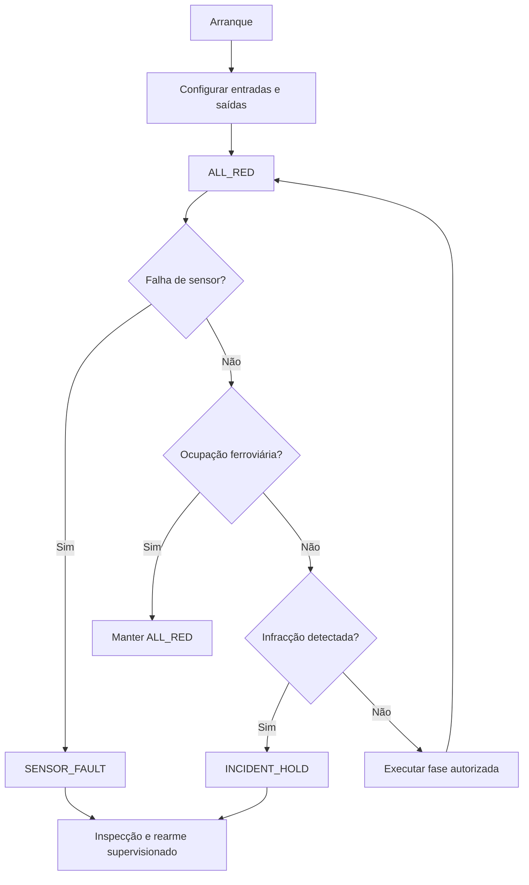
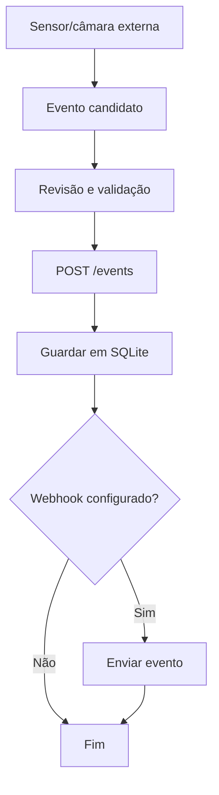
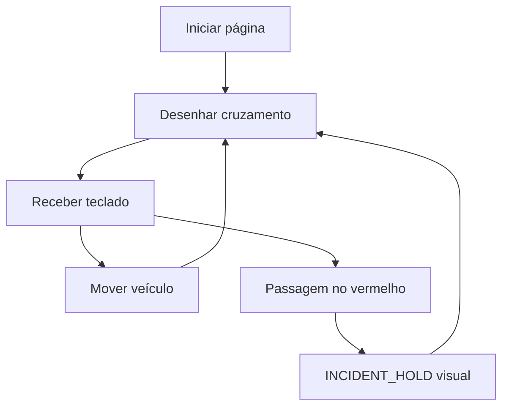

# Fluxogramas

## Controlador

```mermaid
flowchart TD
 A[Arranque] --> B[Configurar entradas e saídas]
 B --> C[ALL_RED]
 C --> D{Falha de sensor?}
 D -- Sim --> E[SENSOR_FAULT]
 D -- Não --> F{Ocupação ferroviária?}
 F -- Sim --> G[Manter ALL_RED]
 F -- Não --> H{Infracção detectada?}
 H -- Sim --> I[INCIDENT_HOLD]
 H -- Não --> J[Executar fase autorizada]
 J --> C
 E --> K[Inspecção e rearme supervisionado]
 I --> K
```

## Registo de evento

```mermaid
flowchart TD
 A[Sensor/câmara externa] --> B[Evento candidato]
 B --> C[Revisão e validação]
 C --> D[POST /events]
 D --> E[Guardar em SQLite]
 E --> F{Webhook configurado?}
 F -- Sim --> G[Enviar evento]
 F -- Não --> H[Fim]
 G --> H
```

## Simulador

```mermaid
flowchart TD
 A[Iniciar página] --> B[Desenhar cruzamento]
 B --> C[Receber teclado]
 C --> D[Mover veículo]
 D --> B
 C --> E[Passagem no vermelho]
 E --> F[INCIDENT_HOLD visual]
 F --> B
```
